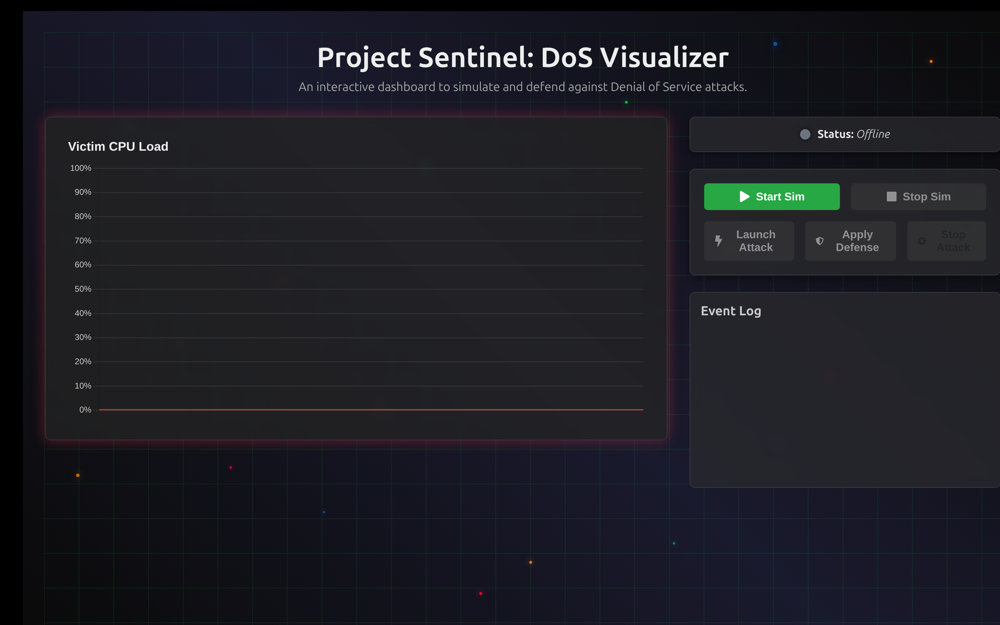
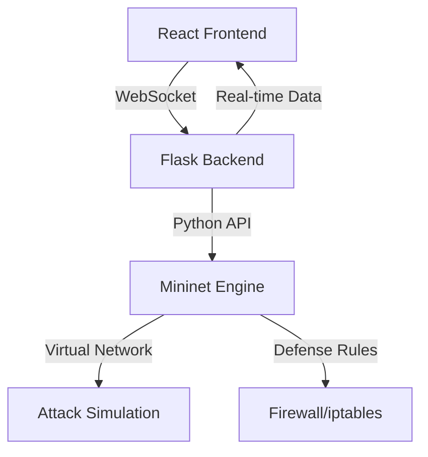

# 🛡️ Project Sentinel: DoS Attack & Defense Visualizer

<div align="center">


**An Interactive Real-Time Dashboard for Simulating and Visualizing DDoS Attacks & Defense Mechanisms**

[🚀 Demo](#-demo) • [📋 Features](#-features) • [🛠️ Installation](#️-installation) • [📖 Usage](#-usage) • [🏗️ Architecture](#️-architecture)

</div>

---

## 📸 Demo


> 
> 

## 🎯 Overview

Project Sentinel is a comprehensive cybersecurity education tool that provides a **real-time, interactive dashboard** for simulating Distributed Denial of Service (DDoS) attacks and their mitigation strategies within a secure, sandboxed virtual network environment.

Perfect for **cybersecurity students**, **network administrators**, and **security researchers** who want to understand attack patterns and defense mechanisms in a controlled environment.

## ✨ Features

### 🔥 Real-Time Visualization
- **Dynamic CPU Load Monitoring** with interactive line charts
- **Live Network Traffic Analysis** 
- **Attack Impact Visualization** with color-coded severity indicators

### 🎮 Interactive Control Panel
- **One-Click Attack Simulation** (SYN Flood, UDP Flood)
- **Defense Mechanism Activation** (Firewall rules, Rate limiting)
- **Simulation State Management** with intelligent UI controls

### 📊 Live Event Logging
- **Timestamped Event Stream** with real-time updates
- **Attack Pattern Analysis** 
- **Defense Effectiveness Metrics**

### 🏛️ Professional Architecture
- **Decoupled Frontend/Backend** design
- **WebSocket Real-Time Communication**
- **Sandboxed Network Environment** using Mininet

## 🛠️ Technology Stack

<div align="center">

| Layer | Technology | Purpose |
|-------|------------|---------|
| **Frontend** |   | Interactive Dashboard |
| **Backend** |   | API & WebSocket Server |
| **Simulation** |  | Network Virtualization |
| **Visualization** |  | Real-time Metrics |

</div>

## 🏗️ Architecture



### 🔄 Data Flow
1. **User Interaction** → React sends commands via WebSocket
2. **Backend Processing** → Flask validates and executes commands
3. **Network Simulation** → Mininet creates virtual environment
4. **Real-time Feedback** → Metrics streamed back to dashboard

## 🚀 Installation

### Prerequisites

```bash
# System Requirements
- Ubuntu 20.04+ (or compatible Linux distribution)
- Python 3.8+
- Node.js 16+
- sudo privileges
```

### 📦 Quick Setup

```bash
# 1. Clone the repository
git clone https://github.com/yourusername/project-sentinel.git
cd project-sentinel

# 2. Install Mininet (if not already installed)
sudo apt update
sudo apt install mininet

# 3. Backend Setup
cd backend
sudo apt install python3-flask python3-flask-cors python3-flask-socketio
# or using pip
pip3 install flask flask-cors flask-socketio

# 4. Frontend Setup
cd ../frontend
npm install
```

## 📖 Usage

### 🖥️ Running the Application

You'll need **3 terminal windows**:

#### Terminal 1: Backend Server
```bash
cd backend
sudo python3 app.py
```
> 🟢 Server running on `http://localhost:5000`

#### Terminal 2: Frontend Server
```bash
cd frontend
npm run dev
```
> 🟢 Dashboard available at `http://localhost:5173`

#### Terminal 3: Testing (Optional)
```bash
# Test API endpoints
curl -X POST http://localhost:5000/api/start-simulation
curl -X POST http://localhost:5000/api/launch-attack
```

### 🎮 Using the Dashboard

1. **🚀 Start Simulation** - Initialize the virtual network
2. **⚔️ Launch Attack** - Begin DDoS simulation
3. **🛡️ Activate Defense** - Deploy countermeasures
4. **📊 Monitor Metrics** - Watch real-time impact
5. **🛑 Stop Simulation** - Clean up resources

## 🔧 Configuration

### Environment Variables
```bash
# Backend Configuration
FLASK_HOST=localhost
FLASK_PORT=5000
MININET_CLEANUP=true

# Frontend Configuration
VITE_API_URL=http://localhost:5000
```

### Attack Parameters
```python
# Customize in backend/simulation_manager.py
ATTACK_DURATION = 30  # seconds
ATTACK_RATE = 1000    # packets/second
TARGET_PORT = 80      # HTTP port
```

## 📄 License

This project is licensed under the MIT License - see the [LICENSE](LICENSE) file for details.


## 🙏 Acknowledgments

- **Team Member** Ayush Rathi(23BCE1509), Harjyot Singh Sehgal(23BCE1609), Rohit(23BCE1982)

---

<div align="center">

**Made with ❤️ for Cybersecurity Education**


</div>
